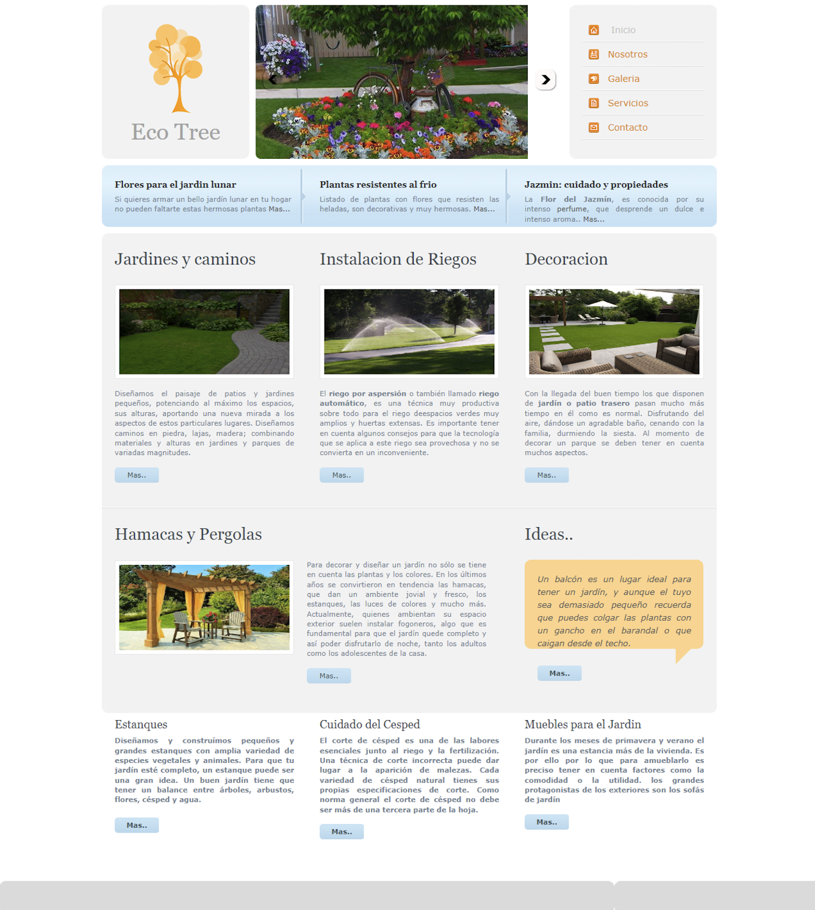

# Evaluación de Desempeño - HTML + CSS + FLEXBOX + BOOTSTRAP

## Temas a Evaluar

- HTML
- CSS
- Flexbox
- Bootstrap

## Criterios de Evaluación

- Evaluar la comprensión de los temas y el uso correcto del lenguaje técnico.
- Evaluar la capacidad de relacionar los temas teóricos con la práctica.
- Desempeño general de los conocimientos adquiridos.
- Codificar en forma correcta.

## Consigna

1. Actualiza tu descompresor de archivos para evitar problemas al descomprimir los archivos descargados del campus.
2. Descomprime el material publicado en el campus para el desempeño (ej: imágenes, indicaciones, archivos adicionales, etc.).
3. Codifica y maqueta tal cual como los archivos de muestra (ej: index, contacto, etc.).
4. Debes respetar la maquetación y el contenido de la/s páginas de muestra.
5. Codifica con HTML, utilizando CSS externo.
6. Maqueta con Flex básicamente (puedes utilizar Bootstrap como alternativa si te resulta cómodo).
7. Entregar en la fecha indicada en el campus.
8. Todos los archivos (.html, .css, imágenes, etc.) deben estar comprimidos con tu nombre y apellido, de manera tal que solo publiques un archivo en el link indicado en el campus.

